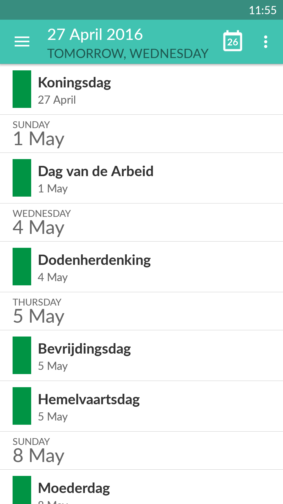
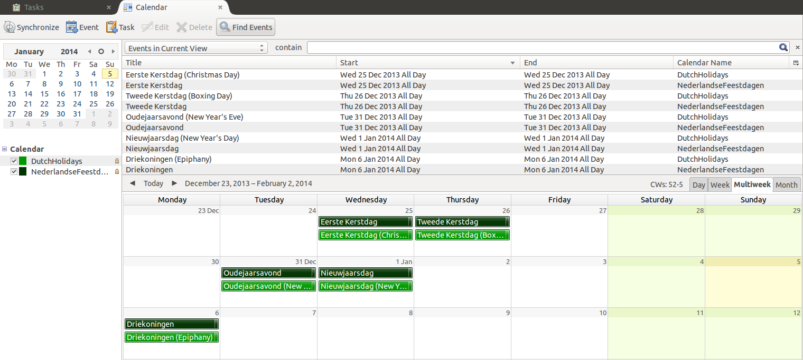

# Dutch Holidays

> <em>I find television very educational. Every time someone switches it on I go into another room and read a good book.</em> — Groucho Marx (1890 – 1977) American Jewish comedian, film star and one of the Marx Brothers

## Introduction

This project offers an overview of Dutch holidays (Nederlandse feestdagen) from 2010 until the year 2050:
- Dutch: click on [webcal://raw.github.com/PanderMusubi/dutch-holidays/master/NederlandseFeestdagen.ics](webcal://raw.github.com/PanderMusubi/dutch-holidays/master/NederlandseFeestdagen.ics) or copy paste `https://raw.github.com/PanderMusubi/dutch-holidays/master/NederlandseFeestdagen.ics`
- English: click on [webcal://raw.github.com/PanderMusubi/dutch-holidays/master/DutchHolidays.ics](webcal://raw.github.com/PanderMusubi/dutch-holidays/master/DutchHolidays.ics) or copy paste `https://raw.github.com/PanderMusubi/dutch-holidays/master/DutchHolidays.ics`
- German: click on [webcal://raw.github.com/PanderMusubi/dutch-holidays/master/NiederlaendischeFeiertage.ics](webcal://raw.github.com/PanderMusubi/dutch-holidays/master/NiederlaendischeFeiertage.ics) or copy paste `https://raw.github.com/PanderMusubi/dutch-holidays/master/NiederlaendischeFeiertage.ics`
- French: click on [webcal://raw.github.com/PanderMusubi/dutch-holidays/master/JoursFeriesAuxPaysBas.ics](webcal://raw.github.com/PanderMusubi/dutch-holidays/master/JoursFeriesAuxPaysBas.ics) or copy paste `https://raw.github.com/PanderMusubi/dutch-holidays/master/JoursFeriesAuxPaysBas.ics`
- Spanish: click on [webcal://raw.github.com/PanderMusubi/dutch-holidays/master/VacacionesHolandesas.ics](webcal://raw.github.com/PanderMusubi/dutch-holidays/master/VacacionesHolandesas.ics) or copy paste `https://raw.github.com/PanderMusubi/dutch-holidays/master/VacacionesHolandesas.ics`

In the non-Dutch versions, the Dutch name is used first first and the translation is in brackets. This is because not all holidays can be unambiguously translated, they do not exist in the other language or they do exist but with a different meaning or with a different date. Examples that are prone for confusion with English are Liberation Day, Mothers' Day, Fathers' Day, Veterans Day etc.

## Scope

Public holidays in the Netherlands can be official or nonofficial, can be free from work or not, can be national, regional or local and can be religious. This makes it not an easy task to select which public holidays to include and which not. Therefore the selection offered here is based upon the following criteria.

All holidays in the Netherlands which effect office hours. This can result in total closure of a business or people leaving early. Subsequently this can effect (part of) the country's infrastructure. The goal is to make people aware about the risk of planning events on or near those days. People, businesses and public services are probably not available as usual.

Perhaps you do not celibate certain religious holidays but your family, friends, colleagues, suppliers or customers do. Next to making you aware of planning risks, this calendar of course also indicates when you might have days off.

School holidays are omitted because they differ throughout the country, are dependent on the level of education and are not planned many years in advance. Most businesses in the Netherlands operate normally during school holidays.

Official Dutch public holidays here are of calendar category Public Holiday. All other holidays have a calendar category called Unofficial Public Holiday. Whether or not this constitutes a free day is entirely up to the line of work. With the exception of Liberation Day, all of category Public Holiday usually result in a day off.

See also the articles [Feestdagen in Nederland](https://nl.wikipedia.org/wiki/Feestdagen_in_Nederland), [Public holidays in the Netherlands](https://en.wikipedia.org/wiki/Public_holidays_in_the_Netherlands) and [Fêtes et jours fériés aux Pays-Bas](https://fr.wikipedia.org/wiki/F%C3%AAtes_et_jours_f%C3%A9ri%C3%A9s_aux_Pays-Bas) on Wikipedia.

## Usage

The calendars provided here are in iCalendar or ICS format. Calendar software that can display these holiday calendars are:
- for OS-X, Windows and Linux: [Mozilla Thunderbird](https://www.mozilla.org/thunderbird/)
- web-based and indirectly on Android too: [Google Calendar](https://google.com/calendar)
- for Android only: ICSdroid from [Google Play](https://play.google.com/store/apps/details?id=at.bitfire.icsdroid) or [F-Droid](https://f-droid.org/repository/browse/?fdfilter=calendar&fdid=at.bitfire.icsdroid)
- for Android only: CalDAV-Sync from [Google Play](https://play.google.com/store/apps/details?id=org.dmfs.caldav.lib) and soon on F-Droid too
- for OS-X only: [Calendar](https://www.apple.com/osx/apps/#calendar)
- for iOS only: [iCloud Calendar](https://www.apple.com/icloud/#ccm)
- for Windows only: [Microsoft Outlook](https://products.office.com/outlook)
- web-based: [Microsoft Outlook.com](https://outlook.com)

See also this [list of applications with iCalendar support](https://en.wikipedia.org/wiki/List_of_applications_with_iCalendar_support) on Wikipedia, with many more native calendar clients and web-based systems such as Nextcloud. Please note that many CMS software support displaying ICS calendars.

Most calendar software can show these Dutch holidays to a color of your choice. Also in some software, a distinction in colour can be configured according to the calendar categories `Public Holiday` and `Unofficial Public Holiday`.

Warning: Please, do **not** import these ICS files into your calendar as they will be added only once and never get updated. Add these calendars as a shared (read-only) network calendar. These calendars do not need frequent updates, however, sometimes bugs are fixed, future years are added or holidays change in date or in name. See for example the transition from Queen's Day to King's Day, that also got another date. Most software will have a maximum update frequency of once a week, which is fine for these calendars. Syncing should also configured to take place only from server to client, computer or phone.

<!--## Dutch version

The calendar with Dutch Holidays in Dutch can be found at:
- development version webcal://raw.github.com/PanderMusubi/dutch-holidays/master/NederlandseFeestdagen.ics hosted by [GitHub](https://github.com/PanderMusubi/dutch-holidays)
- stable version webcal://raw.githubusercontent.com/thundernest/thunderbird-website/master/media/caldata/DutchHolidays.ics hosted by [Thunderbird Github](https://github.com/thundernest/thunderbird-website).
* stable version https://www.thunderbird.net/media/caldata/DutchHolidays.ics
hosted by [Thunderbird](https://www.thunderbird.net/en-US/calendar/holidays/),
see also the QR code below.

## English version

The calendar with Dutch Holidays in English (with Dutch translation) can be found at:
- development version webcal://raw.github.com/PanderMusubi/dutch-holidays/master/DutchHolidays.ics hosted by [GitHub](https://github.com/PanderMusubi/dutch-holidays)
- stable version webcal://raw.githubusercontent.com/thundernest/thunderbird-website/master/media/caldata/DutchHolidaysEnglish.ics hosted by [Thunderbird Github](https://github.com/thundernest/thunderbird-website).
- stable version
https://www.thunderbird.net/media/caldata/DutchHolidaysEnglish.ics hosted by
[Thunderbird](https://www.thunderbird.net/en-US/calendar/holidays/), see also
the QR code below.

## German version

The calendar with Dutch Holidays in German (with Dutch translation) can be found at:
- development version webcal://raw.github.com/PanderMusubi/dutch-holidays/master/NiederlaendischeFeiertage.ics hosted by [GitHub](https://github.com/PanderMusubi/dutch-holidays)
- stable version webcal://raw.githubusercontent.com/thundernest/thunderbird-website/master/media/caldata/DutchHolidaysGerman.ics hosted by [Thunderbird Github](https://github.com/thundernest/thunderbird-website).
- stable version https://www.mozilla.org/media/caldata/DutchHolidaysGerman.ics hosted by [Thunderbird](https://www.thunderbird.net/en-US/calendar/holidays/), see also the QR code below.

## French version

The calendar with Dutch Holidays in French (with Dutch translation) can be found at:
- development version webcal://raw.github.com/PanderMusubi/dutch-holidays/master/JoursFeriesAuxPaysBas.ics hosted by [GitHub](https://github.com/PanderMusubi/dutch-holidays)
- stable version webcal://raw.githubusercontent.com/thundernest/thunderbird-website/master/media/caldata/DutchHolidaysFrench.ics hosted by [Thunderbird Github](https://github.com/thundernest/thunderbird-website).
- stable version https://www.mozilla.org/media/caldata/DutchHolidaysFrench.ics hosted by [Thunderbird](https://www.thunderbird.net/en-US/calendar/holidays/), see also the QR code below.

## Spanish version

The calendar with Dutch Holidays in Spanish (with Dutch translation) can be found at:
- development version webcal://raw.github.com/PanderMusubi/dutch-holidays/master/VacacionesHolandesas.ics hosted by [GitHub](https://github.com/PanderMusubi/dutch-holidays)
- stable version webcal://www.mozilla.org/media/caldata/DutchHolidaysSpanish.ics hosted by [Thunderbird](https://www.thunderbird.net/en-US/calendar/holidays/), see also the QR code below.

-->

## Maintenance

The files are generated from the directories `scripted-holidays`, `unscripted-holidays` and `templates` by running `generate.py`. This will output `*.ics` files. The script `report.sh` will write a short overview in `names-used-*.txt`.

<!--Calendars that have been generated can be validated by:
- http://severinghaus.org/projects/icv/?url=https%3A%2F%2Fraw.github.com%2FPanderMusubi%2Fdutch-holidays%2Fmaster%2FNederlandseFeestdagen.ics
- http://severinghaus.org/projects/icv/?url=https%3A%2F%2Fraw.github.com%2FPanderMusubi%2Fdutch-holidays%2Fmaster%2FDutchHolidays.ics
- http://severinghaus.org/projects/icv/?url=https%3A%2F%2Fraw.github.com%2FPanderMusubi%2Fdutch-holidays%2Fmaster%2FNiederlaendischeFeiertage.ics
- http://severinghaus.org/projects/icv/?url=https%3A%2F%2Fraw.github.com%2FPanderMusubi%2Fdutch-holidays%2Fmaster%2FJoursFeriesAuxPaysBas.ics
- http://severinghaus.org/projects/icv/?url=https%3A%2F%2Fraw.github.com%2FPanderMusubi%2Fdutch-holidays%2Fmaster%2FVacacionesHolandesas.ics-->

## See also

See also the following websites:
- https://www.timeanddate.com/holidays/netherlands/
- https://nl.wikipedia.org/wiki/Feestdagen_in_Nederland
- https://www.wettelijke-feestdagen.nl/

## Migration

The source data and translation for Dutch holiday calendars are slowly migrated to date-holidays. Stay tuned for more information. The ICS format calendar URLs offered here will remain here.

Here are some notes for using date-holidays. Rlevant data for the Netherlands is stored in `data/countries/NL.yaml` and `data/names.yaml`.

A build is done with

    npm run lint
    npm run build
    npm run yaml
    npm test
    npm install

To generate Dutch holidays for a specific year in JSON format, run

    node test/sample.js nl 2025

and for translation in another language than Dutch, run

    node test/sample.js nl 2025 --lang en
    node test/sample.js nl.GR.GRN 2025 --lang de
    node test/sample.js nl.NH.ALK 2025 --lang fr
    node test/sample.js nl.ZH.LDN 2025 --lang es
    node test/sample.js nl.ZH.BRL 2025 --lang it --short

See also https://github.com/commenthol/date-holidays-ical where a buid is done with

    npm run lint
    npm run build
    npm test
    npm install

    pip install -Ur requirement.txt
    pip install -Ur requirement_dev.txt
    
    
    https://icalendar.org/validator.html
    https://icalvalidator.com/index.html
    
    perl -pi -e 'chomp if eof' NL-??-20??.json
